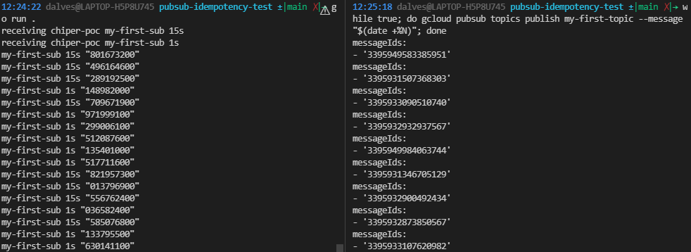

# pubsub-idempotency-test

## Install Golang

```shell
wget https://golang.org/dl/go1.17.3.linux-amd64.tar.gz
rm -rf /usr/local/go && tar -C /usr/local -xzf go1.17.3.linux-amd64.tar.gz
export PATH=$PATH:/usr/local/go/bin
```

## Auth to glcoud

- Create a new google auth key [doc](https://cloud.google.com/docs/authentication/getting-started)
- Setup in the environment
```shell
export GOOGLE_APPLICATION_CREDENTIALS=~/.gcloud/keyfile.json
````

## Create topic and subscriber

```shell
gcloud auth login
gcloud config set project my-project
gcloud pubsub topics create my-first-topic
gcloud pubsub subscriptions create my-first-sub --topic my-first-topic
```

## Run the tests

```shell
go mod download
go run .
# publish messages in another terminal session
while true; do gcloud pubsub topics publish my-first-topic --message "$(date +%N)"; done
```

* You can add more producers by running the publish command in multiple terminal sessions.
* You can add consumers by running the application in multiple sessions or adding more thread in the code.


